# The game

*Penguin Adventure* (夢大陸アドベンチャー, *Yume Tairiku Adventure*) is the
sequel to *Antarctic Adventure*, and it grows from a 32 KB cartridge to 128. The
penguin runs into the screen, dodges what comes at him and has to reach the goal
before the clock runs out.

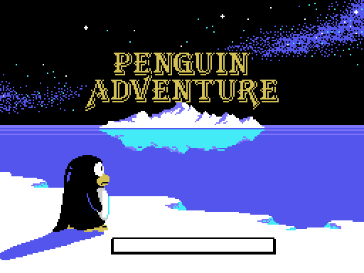

There are **two title screens** and the cartridge picks one from the BIOS
country byte (0x002B). The difference is one extra script, 0xA463, and it only
touches the lettering: the background picture is the same.

## Twenty-four stages, not thirteen

The cartridge *declares* thirteen to the Konami Game Master in its second
header, the one at 0x4010. The game says otherwise: p02:8328 compares the stage
with 0x19, and every per-stage table ends at exactly twenty-four entries.

A stage is walked: 0xE08D is what is left, and it drops by one, in BCD, with
every step. Each step takes something from four scripts:

| script | where | what |
|---|---|---|
| terrain | bank 10, 0x8000 (LEVEL 1) and 0x80F9 (LEVEL 2) | one byte every 100 steps; each byte is eight objects from 0x84EA, released one at a time every 6 steps |
| curves | bank 13, 0xADE8 | distance and which way the road bends (0xE0A6) |
| creatures | bank 9, 0xA8FB | class and how far to walk until the next one |
| warnings | bank 13, 0xB046 | the distance at which the next object comes out as a special crevasse |

Every terrain object is a character drawing at sixteen sizes (0x8682, bank
10): on each step p01:68CA erases the previous one with ones and draws the
next, and after the sixteenth the slot is freed. With that, the whole road can
be walked from the tables:

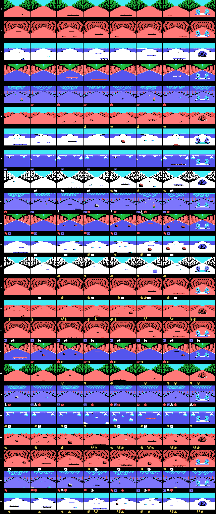

Eight views per stage, from the start to the goal, and under each one the
creatures that spawn in that stretch. What is left out, stated plainly: what
goes by at the roadsides (p01:6AA8 runs on frames with the speed bar pinned,
not on distance), creatures in motion (their path is drawn from the R
register) and the other variant of the objects that aim at the player: here he
runs down the middle.

All of it is checked against openMSX (`tools/coteja.py`): the 5,414 objects
that came out in the test runs, at the same distance and of the same type, and
the screen mirror of 424 dumps, cell by cell, with zero differences.

The title menu lets you choose **LEVEL 1** or **LEVEL 2**, and that choice does
not change how hard a section is: it changes the whole terrain script.
p01:675B picks the table from 0xE08F, the copy p02:813B makes of 0xE082 when
the game starts. Creatures, curves and warnings are the same.

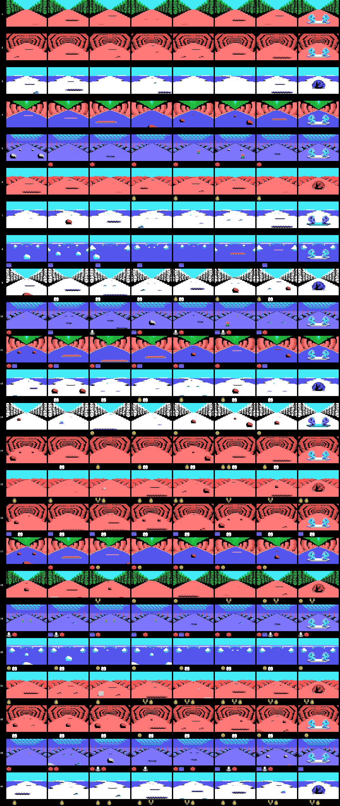

Stages 12, 18 and 24 have a catch: 0x50 away from the goal, p01:6476 loads an
eleven-byte record (0x64C6, 0x64D1 or 0x64DC) that sends the distance left and
the creature, curve and terrain scripts back. Without the item at 0xE16C those
three stages never end.

## The backdrops

Eight backdrops for the twenty-four stages, plus one: space. p02:816D builds
them piece by piece: the three thirds of characters, the ten pieces of
p02:966B —each with its own condition on the backdrop and a 24-byte colour
table that p00:440D applies while painting—, the 672-byte map p01:6000
decompresses at 0xEBE0 and the first step of the ground animation.

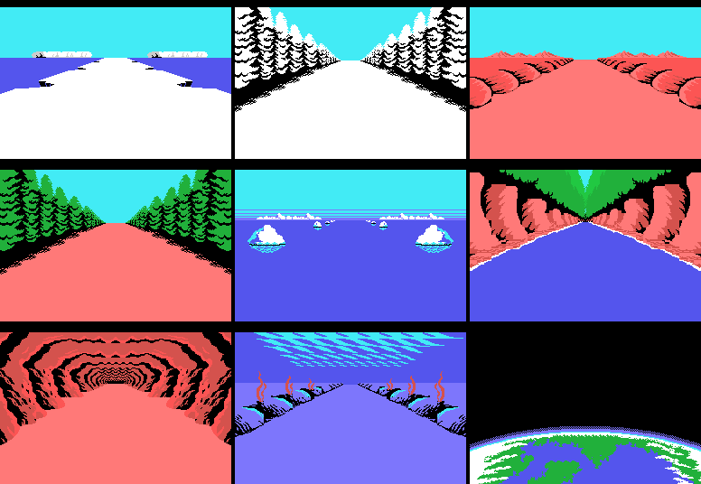

Ice, snowy forest, desert, forest, the sea surface, the river canyon, the
cave, the sea bed and space. Built that way they come out at zero differing
bytes against the first frame of each stage in openMSX.

## The penguin

Black and seen from behind: the poses in the 0xA91D table carry colour 1. It
runs with poses 0-1-0-2 (p02:978E, one every eight frames), and its patterns
change with the terrain: p00:57FB loads it from one of three strips —0x8600 on
land, 0x78F1 on ice, 0x79C7 at sea and in space— with the cartridge's other
painter, `pinta_bloque` (p00:43B3), which uploads sixteen-byte columns and, on
request, the same column mirrored.

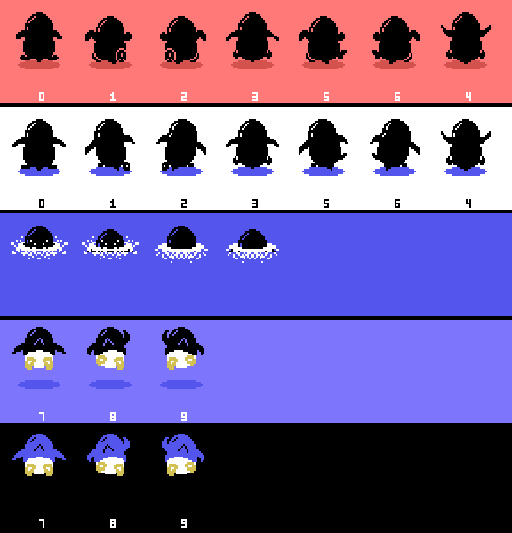

Swimming at the surface there is no pose from the table: p02:9A1D sets pose 10
and swaps the two lower sprites for a splash every sixteen frames. Under the
sea, poses 7, 8 and 9 are laid out in a T (p02:9C3A), and in space that same
figure wears the colours p03:A778 forces on it.

## The creatures

The three object slots at 0xE310 take fifteen classes (p09:A8D1), and the
visible ones pick their drawing by distance: four bands and, if they flap, two
drawings per band that alternate with bit 2 of the frame counter (p09:AA86).
What each drawing is depends on what the stage loads —p02:9689 loads its
own—, so the same class can be one creature in some stages and another
elsewhere.

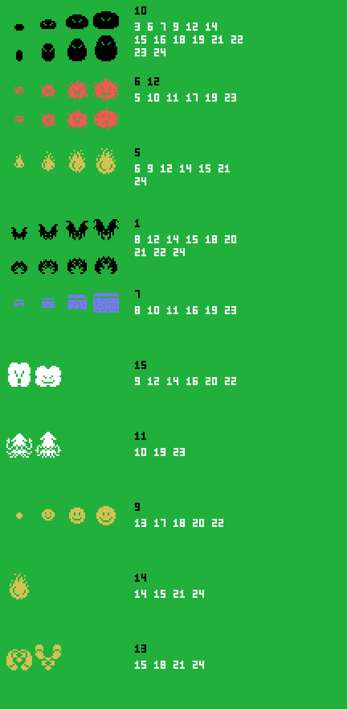

Class 7 is invisible. p09:B8B3 gives it colour 0 —transparent— unless 0xE16A
is carried, and then colour 5.

## The dinosaur and the goal

The last 0x30 of every stage are nine cuts (p01:65CF). Four of them load
characters and the other five copy onto the map a strip bigger than the one
before: whatever is approaching. On the stages whose 1-2-3 counter is 3 —3, 6,
9... up to 24— what approaches is a **dinosaur**, and the fight follows, state
7.

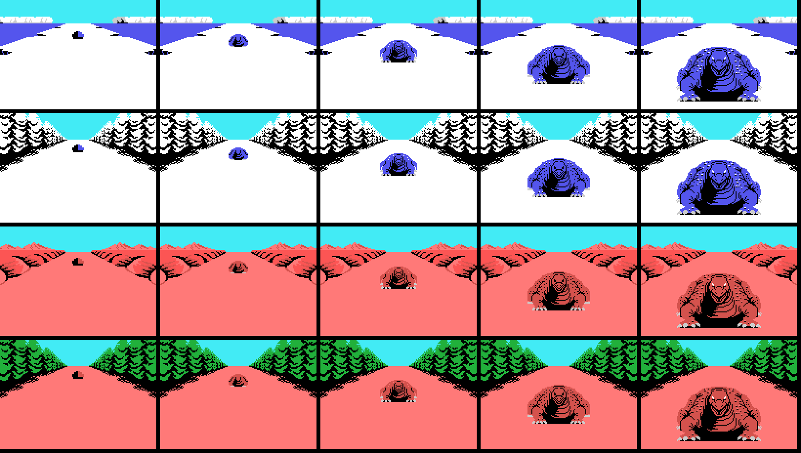

On the rest, the goal: two penguins cheering.

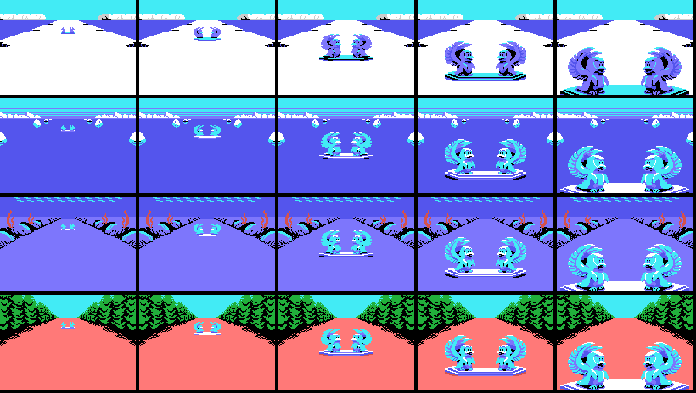

## Space

The bonus stage is not a stage: it is backdrop 8, which p03:B602 sets by hand.
And you get there through a crevasse. The warnings script at 0xB046 flags,
when its distance is reached, the next object to come out (p03:B8AB); that one
comes out as a crevasse —0x0A, 0x0B or 0x2F, the one that aims at the player—
carrying two bytes, the mode and the list. If the penguin falls in and you
press down, p02:99A2 switches to mode 1 and takes it to space.

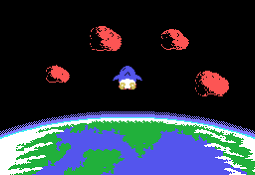

There, objects do not come from the terrain but from the ten lists at 0x81F2
(bank 10). The meteorites are character objects, 0x15 to 0x19, with sixteen
drawings each like the road ones; and what you catch are winged fish, the
sprite objects 0x1A to 0x1F, with three sixteen-step paths (0xA545, 0xA585 and
0xA5C5). The last three repeat a path but their colour flickers between 6 and
0x0A: those are the extra-life ones.

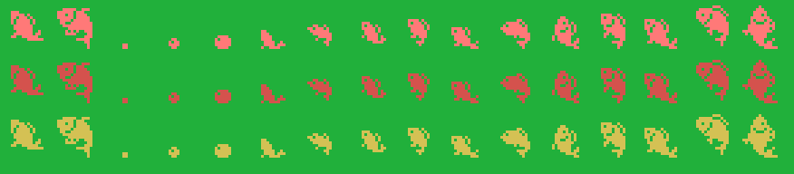

Every return to space is shorter: the ten lengths at 0xB635 go from 0x85 down
to 0x40.

## The clock, which runs on its own

0xE08B is the time, and it drops by one **every 32 frames whether you move or
not** (p02:922D). Below 0x15 it beeps every other frame, and when the stage ends
p02:94D1 turns it into points 0x20 at a time.

What goes down with the terrain is something else, 0xE08D, and the nine
end-of-stage cues come from it: at 0x30, 0x25, 0x20, 0x15, 0x10, 8, 5, 2 and 0
from the goal, something different happens (p01:65CF).

## The shop and the gambling machine

Between stages there are two places to spend your points.

The **shop** has six two-byte slots —what it is and what it costs—, a cursor that
moves left and right with sound 0x23, and the score acting as money. Buying
subtracts in BCD; if you cannot afford it, sound 0x25 plays and nothing happens.

And the **gambling machine**:

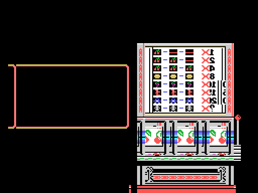

You bet by moving money between the score and a purse —up and down one at a
time, left and right ten at a time—, the three reels spin and the stake is
multiplied by whatever comes up. The payout table is painted on the machine
itself, and it says exactly what the code says.

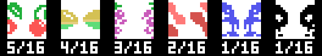

The cherry takes **five** of the sixteen slots in the table at 0x7B34, so it
comes up 31.2 % of the time per reel. And it is the only symbol that counts on
its own: one pays ×1, two ×2 and three ×4. The others pay only in threes —×8,
×10, ×15, ×20 and the jackpot—. At least one cherry shows on **67.5 %** of the
spins.

## What you carry

Five slots at 0xE440, and what they hold decides whether a hit kills:

| what you carry | what it saves you from |
|---|---|
| 0xE1F1 | everything: any hit and any hole |
| 0xE164 | creature classes 6 and 12; one is spent per hit |
| 0xE165 | classes 1 and 13; one is spent per hit |
| 0xE170 | classes 5 and 14; this one is not spent |
| 0xE163 | class 6 of the other creature slots |
| 0xE16B | class 4, which does not kill: it only freezes the game for 0x80 frames |

And the holes in the ground —the class 14 objects— cost a life unless you carry
0xE1F1, 0xE171 or 0xE172. With 0xE1F1 you not only do not fall: the hole changes
variant and 768 points drop in.
