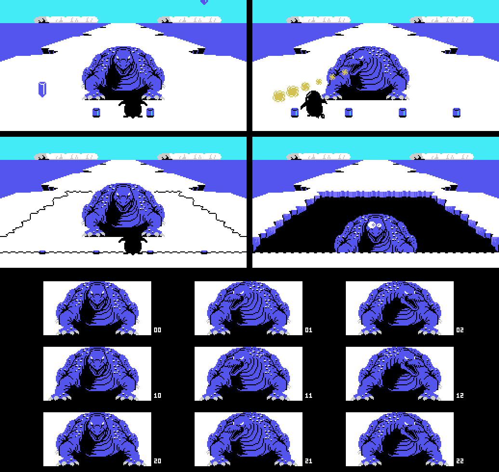
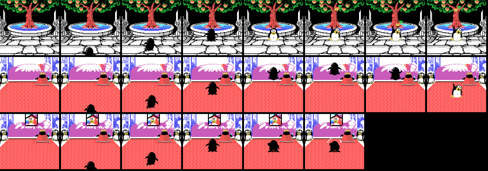
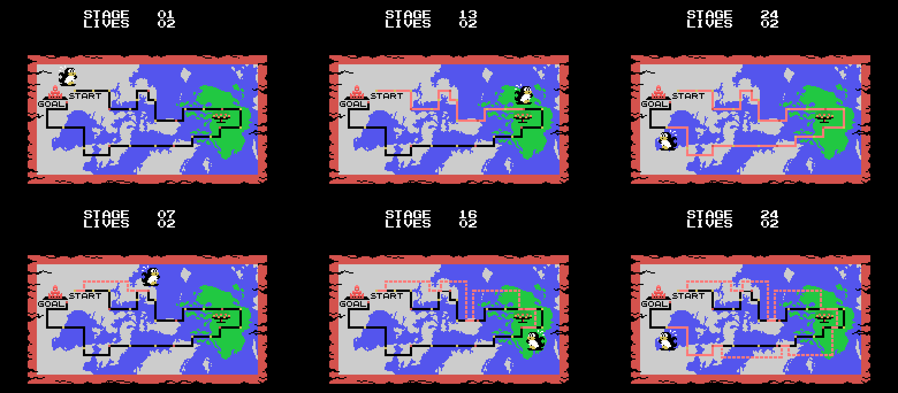
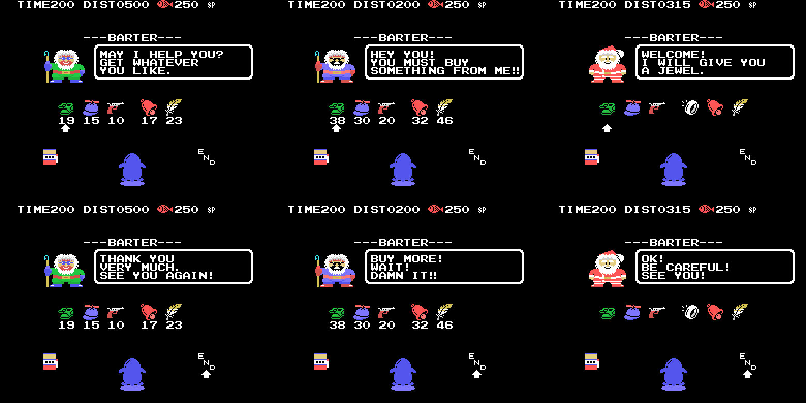
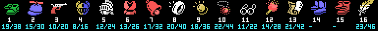

# The game

*Penguin Adventure* (夢大陸アドベンチャー, *Yume Tairiku Adventure*) is the
sequel to *Antarctic Adventure*, and it grows from a 32 KB cartridge to 128. The
penguin runs into the screen, dodges what comes at him and has to reach the goal
before the clock runs out.

There are **two title screens** and the cartridge picks one from the BIOS
country byte (0x002B). The difference is one extra script, 0xA463, and it only
touches the lettering: the background picture is the same.

## Twenty-four stages, not thirteen

The cartridge *declares* thirteen to the Konami Game Master in its second
header, the one at 0x4010. The game says otherwise: p02:8328 compares the stage
with 0x19, and every per-stage table ends at exactly twenty-four entries.

A stage is walked: 0xE08D is what is left, and it drops by one, in BCD, with
every step. Each step takes something from four scripts:

| script | where | what |
|---|---|---|
| terrain | bank 10, 0x8000 (LEVEL 1) and 0x80F9 (LEVEL 2) | one byte every 100 steps; each byte is eight objects from 0x84EA, released one at a time every 6 steps |
| curves | bank 13, 0xADE8 | distance and which way the road bends (0xE0A6) |
| creatures | bank 9, 0xA8FB | class and how far to walk until the next one |
| warnings | bank 13, 0xB046 | the distance at which the next object comes out as a special crevasse |

Every terrain object is a character drawing at sixteen sizes (0x8682, bank
10): on each step p01:68CA erases the previous one with ones and draws the
next, and after the sixteenth the slot is freed. With that, the whole road can
be walked from the tables:

Eight views per stage, from the start to the goal, and under each one the
creatures that spawn in that stretch. What is left out, stated plainly: what
goes by at the roadsides (p01:6AA8 runs on frames with the speed bar pinned,
not on distance), creatures in motion (their path is drawn from the R
register) and the other variant of the objects that aim at the player: here he
runs down the middle.

All of it is checked against openMSX (`tools/coteja.py`): the 5,414 objects
that came out in the test runs, at the same distance and of the same type, and
the screen mirror of 424 dumps, cell by cell, with zero differences.

The title menu lets you choose **LEVEL 1** or **LEVEL 2**, and that choice does
not change how hard a section is: it changes the whole terrain script.
p01:675B picks the table from 0xE08F, the copy p02:813B makes of 0xE082 when
the game starts. Creatures, curves and warnings are the same.

Stages 12, 18 and 24 have a catch: 0x50 away from the goal, p01:6476 loads an
eleven-byte record (0x64C6, 0x64D1 or 0x64DC) that sends the distance left and
the creature, curve and terrain scripts back. Without the item at 0xE16C those
three stages never end.

## The backdrops

Eight backdrops for the twenty-four stages, plus one: space. p02:816D builds
them piece by piece: the three thirds of characters, the ten pieces of
p02:966B —each with its own condition on the backdrop and a 24-byte colour
table that p00:440D applies while painting—, the 672-byte map p01:6000
decompresses at 0xEBE0 and the first step of the ground animation.

Ice, snowy forest, desert, forest, the sea surface, the river canyon, the
cave, the sea bed and space. Built that way they come out at zero differing
bytes against the first frame of each stage in openMSX.

## The penguin

Black and seen from behind: the poses in the 0xA91D table carry colour 1. It
runs with poses 0-1-0-2 (p02:978E, one every eight frames), and its patterns
change with the terrain: p00:57FB loads it from one of three strips —0x8600 on
land, 0x78F1 on ice, 0x79C7 at sea and in space— with the cartridge's other
painter, `pinta_bloque` (p00:43B3), which uploads sixteen-byte columns and, on
request, the same column mirrored.

Swimming at the surface there is no pose from the table: p02:9A1D sets pose 10
and swaps the two lower sprites for a splash every sixteen frames. Under the
sea, poses 7, 8 and 9 are laid out in a T (p02:9C3A), and in space that same
figure wears the colours p03:A778 forces on it.

## The creatures

The three object slots at 0xE310 take fifteen classes (p09:A8D1), and the
visible ones pick their drawing by distance: four bands and, if they flap, two
drawings per band that alternate with bit 2 of the frame counter (p09:AA86).
What each drawing is depends on what the stage loads —p02:9689 loads its
own—, so the same class can be one creature in some stages and another
elsewhere.

Class 7 is invisible. p09:B8B3 gives it colour 0 —transparent— unless 0xE16A
is carried, and then colour 5.

## The dinosaur and the goal

The last 0x30 of every stage are nine cuts (p01:65CF). Four of them load
characters and the other five copy onto the map a strip bigger than the one
before: whatever is approaching. On the stages whose 1-2-3 counter is 3 —3, 6,
9... up to 24— what approaches is a **dinosaur**, and the fight follows, state
7 (below).

On the rest, the goal: two penguins cheering.

## The fight

When the dinosaur arrives, four blocks of ice fall from the sky and stay on the
road (p03:B12B). The dinosaur moves between five columns and always looks
towards the penguin: nine drawings, three steps by three sides (0xA842). Every
so often it throws something (p03:B184): first it blinks as a warning, then it
aims and comes down in three stretches, and in the last one, if it hits you,
you lose the life and nothing saves you. It takes twenty hits. On the
twentieth the ice cracks, a hole opens and the dinosaur sinks in ten steps.

At the top, the four moments; below, the nine drawings. It all comes from the
tables and is checked against more than three thousand openMSX dumps of stages
3, 6 and 9: zero differences.

## The tree and the two endings

When stages 12 and 24 end, p02:82C3 leaves in 0xE0B9 which scene comes next
and p03:AA80 builds it: 2 after stage 12, the **tree** halfway through; after
stage 24, 0 for the **good** ending and 1 for the **bad** one, depending on how
many times you paused (see [Findings](FINDINGS.html)).

All three are built the same way. The characters, from p00:48C3 (the garden)
or p00:48FC (the palace); the screen, 32 columns of 21 rows in bank 13 (0xB2EC
the garden, 0xB5F1 the palace) that p01:7B85 paints one at a time **from the
middle outwards**; and on top, the messages, compressed scripts p01:7BE7
unpacks. The bad ending uses the same palace, but while its ten middle columns
are being painted p01:7BC4 copies into rows 8 to 12 the fifty bytes at 0xB963:
what takes the princess's place.

On top, the sprites as they are when the message appears: in the tree, the
nine-sprite figure at 0xA456 and the apple that has fallen, resting on the last
of the seventeen pairs at 0xAD88; in the good ending, that same figure; and in
the bad one, the penguin seen from behind, crying in front of the king (the
tears at 0xADEF), with the two sprites at 0xAE07. Checked against openMSX: the
tables, the screen with its messages and the sprites, which are those of a real
frame, not one more and not one fewer. Zero differences.

In all three scenes the penguin walks in from the bottom, seen from behind, and
goes up one row every four frames (p03:ACE6). In the tree it eats the apple
that falls and bounces (0xAD88); in the good ending it jumps next to the
princess (0xADBA); in the bad one, it cries (0xADD7 and 0xADEF).

## Space

The bonus stage is not a stage: it is backdrop 8, which p03:B602 sets by hand.
You go up by touching what flies across above the road: p03:B3A0 sets mode 1
(0xE0A2), picks one of the ten lists with 0xE0AD and leaves the penguin in
state 0x10, the one for going up.

There, objects do not come from the terrain but from the ten lists at 0x81F2
(bank 10). The meteorites are character objects, 0x15 to 0x19, with sixteen
drawings each like the road ones; and what you catch are winged fish, the
sprite objects 0x1A to 0x1F, with three sixteen-step paths (0xA545, 0xA585 and
0xA5C5). The last three repeat a path but their colour flickers between 6 and
0x0A: those are the extra-life ones.

Every return to space is shorter: the ten lengths at 0xB635 go from 0x85 down
to 0x40.

## The warps

The warnings script at 0xB046 flags, when its distance is reached, the next
object to come out (p03:B8AB): it comes out as a crevasse carrying two bytes,
the mode and the list. Depending on the mode, the crevasse is one of two
things.

With mode 2 it is 0x2F, the one that aims at the player. If the penguin falls
in and you press **down**, p02:99A2 moves to state 10: the **WARP**, a
0x150-step run through backdrop 9 —the cave of backdrop 6 in other colours—
with that word on the status bar. When it ends, p03:B94A reads the 17-byte
record at 0xB79B picked by the list and **adds stages**: you come out in
another one, with its distance left and its scripts set. There are six, and
all six are measured in openMSX:

| crevasse on stage | at (0xE08D) | list | you come out on stage | with distance left |
|---|---|---|---|---|
| 1 | 0x0260 | 0x0A | 6 | 0x0280 |
| 6 | 0x0160 | 0x0B | 9 | 0x0560 |
| 9 | 0x0350 | 0x0C | 12 | 0x0880 |
| 13 | 0x0370 | 0x0D | 15 | 0x0525 |
| 15 | 0x0095 | 0x0E | 18 | 0x0805 |
| 18 | 0x0432 | 0x0F | 21 | 0x1049 |

## The map

Before every stage (state 4, p02:81A0) the map of the twenty-four stages shows
up, with STAGE and LIVES on top. The scene script at p02:8AEC draws it, one
step per frame. First come the fourteen lines of the picture at 0x8E7C. Then it
walks the 0x8FE7 records (stage, entry and colour address) and turns the road
already travelled from black to red, until it reaches the current stage, where
it puts the penguin. Its square comes from the 0x917B table; from stage 15
onwards it faces the other way.

If a record names one of the six warps (0x8D85) and its flag is set
(0xE0C6-0xE0CB), the script jumps to the warp's entry and writes its trace: on
the map, the warp shows up as a dotted road.

Top row: stages 1, 13 and 24 with no warps; bottom row: 7, 16 and 24 with
warps. Checked against 32 openMSX dumps (the 24 stages and seven with warps):
zero differences.

## The hidden shops

With modes 3, 4 and 5 the warnings-script crevasse is 0x0A or 0x0B, and
falling into its middle is enough: p01:72F2 moves to state 12, the **shop**
(---BARTER---). The mode is the shopkeeper, and each one has his own price
table (p01:6CC3):

| mode | shopkeeper | prices | how many |
|---|---|---|---|
| 3 | the usual one | those at 0x6FD5 | 18 |
| 4 | the one who warns *HEY YOU! YOU MUST BUY SOMETHING FROM ME!!* | those at 0x6FE5: **double**, except item 7 (32, not 34) | 20 |
| 5 | **Santa Claus** | those at 0x6FF5: **all zero**; and after the first item p01:6F09 closes the shop: **he gives one away** | 3 |

p01:6BEF builds the screen in one go: the shop characters (0x88CA from bank
5; in mode 4, on top, the colours at 0x8ABB, which are the angry face), the
status-bar ones (0xB71B, which are also the item drawings), the mode's
lettering (0xA563, 0xA59D or 0xA5D7: ---BARTER---, the shopkeeper and END)
and the six slots at 0xE100, with the price two rows below and the cursor on
the first full one. Then the penguin walks in from the top (p02:9FC9, three
rows per frame down to row 0x90) and the shop (p01:6E1E) paints the
shopkeeper's greeting every frame inside the speech bubble at 0xB12E:

| shopkeeper | greeting | farewell |
|---|---|---|
| the usual one | *MAY I HELP YOU? GET WHATEVER YOU LIKE.* (0xB038) | *THANK YOU VERY MUCH. SEE YOU AGAIN!* (0xB094) |
| the double one | *HEY YOU! YOU MUST BUY SOMETHING FROM ME!!* (0xB065) | *BUY MORE! WAIT! DAMN IT!!* (0xB0BE) |
| Santa Claus | *WELCOME! I WILL GIVE YOU A JEWEL.* (0xB0DD) | *OK! BE CAREFUL! SEE YOU!* (0xB105) |

Left and right move the cursor through the eight positions at 0x7005: the six
slots, the purse on the left —which only shows up with points (0xE134) and
leads to the gambling machine— and END, which wipes the greeting with its own
script and the mask at zero (p01:6F2E), paints the farewell, waits 0x80 frames
and leaves. Fire buys: it subtracts the price from the score in BCD and
p03:BA2F records the item at 0xE160 + k. The six screens in the picture are
checked against 14 openMSX dumps (tools/omsx_tienda.tcl): zero differences.

The items on offer come from the stage's seven-item list (0xAF90), and those
already carried are left out (0xE160 onwards). There are sixteen, drawn with
the status-bar characters, four per item from 0xB2:

What each one does comes from whoever reads its flag at 0xE160 + k; the value
recorded on purchase is at 0xBABB. The names are what the drawings show, not
the manual's:

| # | what it is | what it does |
|---|---|---|
| 1 | the green boots | the speed bar rises sooner: cap 5 instead of 7 (p02:91C4) |
| 2 | the propeller cap | changes the jump: state 2 instead of 1 (p02:975F), and 7 instead of 6 when swimming |
| 3 | the pistol | the second button shoots (p03:BD8A) |
| 4 | the helmet | stops three hits from class 6 of the other slots (p01:76E0); one is spent per hit |
| 5 | the white helm | stops three hits from classes 6 and 12 (p01:75E4) |
| 6 | the red armour | stops three hits from classes 1 and 13 (p01:75FA) |
| 7 | the bell | sound 0x31 plays when the warnings script releases a mode-2 crevasse, a warp (p03:B8C4) |
| 8 | the ring | wakes up the stage 6 secret, which gives item 13 (p03:BE7D) |
| 9 | the gold coin | on backdrop 7 it stops you entering crevasses 0x13 and 0x14 (p01:740D) |
| 10 | the red pendant | unlimited gambling: without it, three spins (0xE134) and out (p01:7AD5) |
| 11 | the glasses | the class 7 creature becomes visible, in colour 5 (p09:B8B3); lasts two stages (p00:46C5) |
| 12 | the torch | class 4 at 0xE370, the one that freezes the game for 0x80 frames, does nothing (p01:76CE); lasts two stages |
| 13 | the white bird | lets stages 12, 18 and 24 end instead of p01:6476 sending you back (p01:65C2) |
| 14 | the blue boots | sideways at double speed, two pixels per frame (p03:A889); not for sale: it is the prize of the stage 13 secret |
| 15 | the red boots | removes the sideways drift at 0xE0A6 (p03:A8BB); nobody sells it and nothing we have found gives it |
| 16 | the feather | you can change direction in mid-air (p02:979D) |

Item 13 is sold only by the shops on stages 12, 18 and 24, and the stage 12
Santa Claus gives it away. The secrets' prizes —13, 14, 16, and 17 and 18,
which have no drawing— come in through another door: they appear on the road
and get picked up (p03:B36B).

The 41 shops, with the distance of their warning (the table is written
by `tools/tienda.py tabla`):

| stage | at (0xE08D) | shopkeeper | items |
|---|---|---|---|
| 1 | 0x0500 | normal | 1 2 3 7 16 |
| 1 | 0x0350 | normal | 1 2 3 7 16 |
| 1 | 0x0200 | **expensive**, double | 1 2 3 7 16 |
| 2 | 0x0400 | **expensive**, double | 1 2 3 10 16 9 |
| 2 | 0x0200 | normal | 1 2 3 10 16 9 |
| 2 | 0x0100 | **expensive**, double | 1 2 3 10 16 9 |
| 3 | 0x0700 | **expensive**, double | 1 2 3 10 5 |
| 3 | 0x0680 | **expensive**, double | 1 2 3 10 5 |
| 3 | 0x0420 | normal | 1 2 3 10 5 |
| 3 | 0x0100 | **expensive**, double | 1 2 3 10 5 |
| 6 | 0x0350 | normal | 1 2 3 8 7 16 |
| 6 | 0x0315 | **Santa Claus: free** | 1 2 3 8 7 16 |
| 7 | 0x0580 | **expensive**, double | 1 2 3 16 11 9 |
| 7 | 0x0280 | **expensive**, double | 1 2 3 16 11 9 |
| 9 | 0x0420 | normal | 7 4 12 5 11 9 |
| 9 | 0x0200 | normal | 7 4 12 5 11 9 |
| 12 | 0x0800 | **expensive**, double | 13 4 1 2 10 16 |
| 12 | 0x0500 | **expensive**, double | 13 4 1 2 10 16 |
| 12 | 0x0450 | normal | 13 4 1 2 10 16 |
| 12 | 0x0200 | **Santa Claus: free** | 13 4 1 2 10 16 |
| 13 | 0x0380 | **expensive**, double | 1 2 3 8 7 10 |
| 13 | 0x0204 | normal | 1 2 3 8 7 10 |
| 13 | 0x0195 | **expensive**, double | 1 2 3 8 7 10 |
| 14 | 0x0195 | normal | 1 4 2 8 3 16 |
| 14 | 0x0109 | **expensive**, double | 1 4 2 8 3 16 |
| 15 | 0x0495 | normal | 1 3 2 6 7 16 |
| 15 | 0x0450 | normal | 1 3 2 6 7 16 |
| 16 | 0x0356 | **expensive**, double | 1 4 2 9 11 5 |
| 18 | 0x0830 | normal | 13 4 12 6 11 5 |
| 18 | 0x0460 | **expensive**, double | 13 4 12 6 11 5 |
| 18 | 0x0446 | normal | 13 4 12 6 11 5 |
| 21 | 0x0999 | **Santa Claus: free** | 1 2 3 6 10 9 |
| 21 | 0x0880 | **expensive**, double | 1 2 3 6 10 9 |
| 21 | 0x0400 | **expensive**, double | 1 2 3 6 10 9 |
| 21 | 0x0198 | normal | 1 2 3 6 10 9 |
| 22 | 0x0949 | **expensive**, double | 1 4 12 9 11 5 |
| 22 | 0x0883 | normal | 1 4 12 9 11 5 |
| 22 | 0x0851 | normal | 1 4 12 9 11 5 |
| 22 | 0x0282 | **expensive**, double | 1 4 12 9 11 5 |
| 24 | 0x1125 | **expensive**, double | 13 1 2 6 10 16 |
| 24 | 0x0601 | normal | 13 1 2 6 10 16 |

## The clock, which runs on its own

0xE08B is the time, and it drops by one **every 32 frames whether you move or
not** (p02:922D). Below 0x15 it beeps every other frame, and when the stage ends
p02:94D1 turns it into points 0x20 at a time.

What goes down with the terrain is something else, 0xE08D, and the nine
end-of-stage cues come from it: at 0x30, 0x25, 0x20, 0x15, 0x10, 8, 5, 2 and 0
from the goal, something different happens (p01:65CF).

## The shop and the gambling machine

Points are spent in two places: the crevasse shops above and the gambling machine.

The **shop** has six two-byte slots —what it is and what it costs—, a cursor that
moves left and right with sound 0x23, and the score acting as money. Buying
subtracts in BCD; if you cannot afford it, sound 0x25 plays and nothing happens.
It is all above, under *The hidden shops*; from the shop you reach the machine
through the purse, cursor position 6 (warning 2, p02:8751).

And the **gambling machine**:

You bet by moving money between the score and a purse —up and down one at a
time, left and right ten at a time—, the three reels spin and the stake is
multiplied by whatever comes up. The payout table is painted on the machine
itself, and it says exactly what the code says.

The cherry takes **five** of the sixteen slots in the table at 0x7B34, so it
comes up 31.2 % of the time per reel. And it is the only symbol that counts on
its own: one pays ×1, two ×2 and three ×4. The others pay only in threes —×8,
×10, ×15, ×20 and the jackpot—. At least one cherry shows on **67.5 %** of the
spins.

## What you carry

Five slots at 0xE440, and what they hold decides whether a hit kills:

| what you carry | what it saves you from |
|---|---|
| 0xE1F1 | everything: any hit and any hole |
| 0xE164, the white helm (5) | creature classes 6 and 12; one is spent per hit |
| 0xE165, the red armour (6) | classes 1 and 13; one is spent per hit |
| 0xE170, the stage 9 secret's prize | classes 5 and 14; this one is not spent |
| 0xE163, the helmet (4) | class 6 of the other creature slots |
| 0xE16B, the torch (12) | class 4, which does not kill: it only freezes the game for 0x80 frames |

And the holes in the ground —the class 14 objects— cost a life unless you carry
0xE1F1, 0xE171 or 0xE172. With 0xE1F1 you not only do not fall: the hole changes
variant and 768 points drop in.
