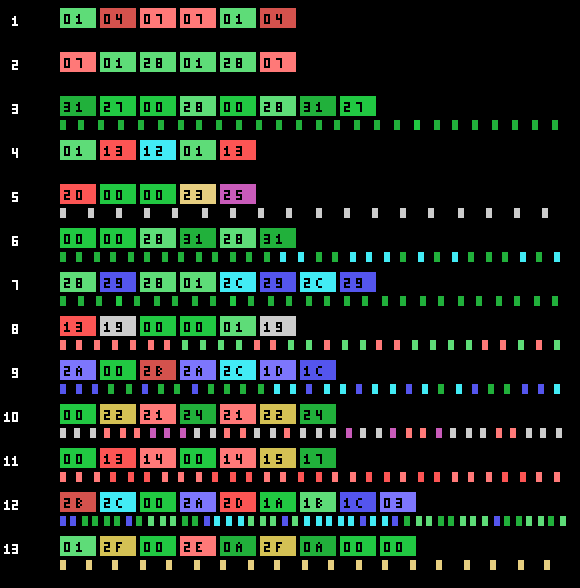

# The game

*Penguin Adventure* (夢大陸アドベンチャー, *Yume Tairiku Adventure*) is the
sequel to *Antarctic Adventure*, and it grows from a 32 KB cartridge to 128. The
penguin runs into the screen, dodges what comes at him and has to reach the goal
before the clock runs out.

There are **two title screens** and the cartridge picks one from the BIOS
country byte (0x002B). The difference is one extra script, 0xA463, and it only
touches the lettering: the background picture is the same.

## Twenty-four stages, not thirteen

The cartridge *declares* thirteen to the Konami Game Master in its second
header, the one at 0x4010. The game says otherwise: p02:8328 compares the stage
with 0x19 and the three script tables —terrain, creatures and the third one—
close at exactly twenty-four entries.

Each row is a stage. The coloured blocks are its terrain sections in the order
they come, and the marks below are the creatures the script spawns. The first
three stages spawn none: their script is a bare `0xFF`.

And the two-player game is a **whole different design**, not a variation: not one
section matches the one-player table byte for byte.

## Ten backdrops

The terrain is built from ten backdrops, each with its characters —three loads,
one per third of the screen— and 672 bytes of name table that p01:6000
decompresses at 0xEBE0.

Backdrops 8 and 9 are used by none of the twenty-four stages: p03:B602 and
p03:B932 set them by hand for two interludes.

## The clock, which runs on its own

0xE08B is the time, and it drops by one **every 32 frames whether you move or
not** (p02:922D). Below 0x15 it beeps every other frame, and when the stage ends
p02:94D1 turns it into points 0x20 at a time.

What goes down with the terrain is something else, 0xE08D, and the nine
end-of-stage cues come from it: at 0x30, 0x25, 0x20, 0x15, 0x10, 8, 5, 2 and 0
from the goal, something different happens (p01:65CF).

## The shop and the gambling machine

Between stages there are two places to spend your points.

The **shop** has six two-byte slots —what it is and what it costs—, a cursor that
moves left and right with sound 0x23, and the score acting as money. Buying
subtracts in BCD; if you cannot afford it, sound 0x25 plays and nothing happens.

And the **gambling machine**:

You bet by moving money between the score and a purse —up and down one at a
time, left and right ten at a time—, the three reels spin and the stake is
multiplied by whatever comes up. The payout table is painted on the machine
itself, and it says exactly what the code says.

The cherry takes **five** of the sixteen slots in the table at 0x7B34, so it
comes up 31.2 % of the time per reel. And it is the only symbol that counts on
its own: one pays ×1, two ×2 and three ×4. The others pay only in threes —×8,
×10, ×15, ×20 and the jackpot—. At least one cherry shows on **67.5 %** of the
spins.

## What you carry

Five slots at 0xE440, and what they hold decides whether a hit kills:

| what you carry | what it saves you from |
|---|---|
| 0xE1F1 | everything: any hit and any hole |
| 0xE164 | creature classes 6 and 12; one is spent per hit |
| 0xE165 | classes 1 and 13; one is spent per hit |
| 0xE170 | classes 5 and 14; this one is not spent |
| 0xE163 | class 6 of the other creature slots |
| 0xE16B | class 4, which does not kill: it only freezes the game for 0x80 frames |

And the holes in the ground —the class 14 objects— cost a life unless you carry
0xE1F1, 0xE171 or 0xE172. With 0xE1F1 you not only do not fall: the hole changes
variant and 768 points drop in.
