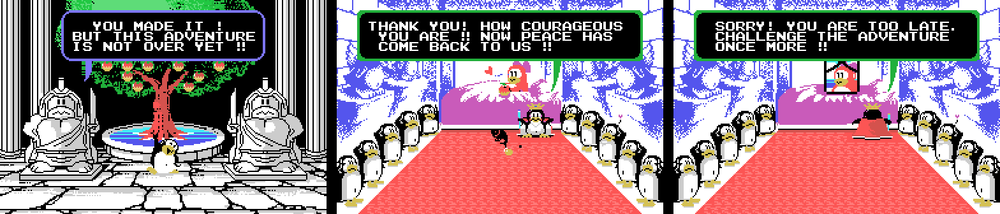
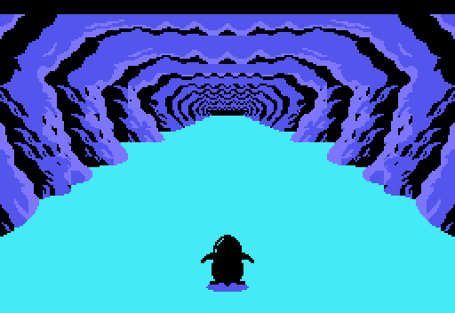

# El juego

*Penguin Adventure* (夢大陸アドベンチャー, *Yume Tairiku Adventure*) es la
continuación de *Antarctic Adventure*, y de un cartucho de 32 KB pasa a 128. El
pingüino corre hacia el fondo de la pantalla, esquiva lo que le sale al paso y
tiene que llegar a la meta antes de que se le acabe el tiempo.

Hay **dos pantallas de título** y el cartucho elige con el byte de país de la
BIOS (0x002B). La diferencia es un guion de más, el 0xA463, y sólo toca el
rótulo: el dibujo de fondo es el mismo.

## Veinticuatro fases, no trece

El cartucho le *declara* trece al Konami Game Master en su segunda cabecera, la
de 0x4010. El juego dice otra cosa: p02:8328 compara la fase con 0x19, y las
tablas de cada fase cierran en veinticuatro entradas justas.

Cada fase se anda: 0xE08D es lo que queda y baja uno, en BCD, con cada paso. Y
a cada paso le toca algo de cuatro guiones:

| guion | dónde | qué |
|---|---|---|
| el terreno | banco 10, 0x8000 (LEVEL 1) y 0x80F9 (LEVEL 2) | un byte cada 100 pasos; cada byte son ocho cosas de 0x84EA, que salen de una en una cada 6 pasos |
| las curvas | banco 13, 0xADE8 | distancia y hacia dónde tira la carretera (0xE0A6) |
| los bichos | banco 9, 0xA8FB | clase y cuánto hay que andar hasta el siguiente |
| los avisos | banco 13, 0xB046 | la distancia a la que la siguiente cosa sale como grieta especial |

Cada cosa del terreno es un dibujo de caracteres en dieciséis tamaños (0x8682,
banco 10): en cada paso p01:68CA borra el anterior con unos y pinta el
siguiente, y al decimosexto la ranura queda libre. Con eso la carretera se
puede andar entera desde las tablas:

Ocho vistas por fase, de la salida a la meta, y debajo de cada una los bichos
que salen en ese tramo. Lo que no sale, dicho: lo que pasa por los lados de la
carretera (p01:6AA8 va por cuadros con la barra de velocidad clavada, no por
distancia), los bichos en movimiento (su recorrido lo sortea el registro R) y
la otra variante de las cosas que apuntan al jugador: aquí va por el centro.

Todo está cotejado con openMSX (`tools/coteja.py`): las 5.414 cosas que
salieron en las partidas de prueba, a la misma distancia y del mismo tipo, y el
espejo de pantalla de 424 volcados, casilla a casilla, con cero diferencias.

El menú del título deja elegir entre **LEVEL 1** y **LEVEL 2**, y esa elección
no cambia lo difícil que es un tramo: cambia el guion del terreno entero.
p01:675B escoge tabla con 0xE08F, la copia que p02:813B hace de 0xE082 al
empezar la partida. Los bichos, las curvas y los avisos son los mismos.

Las fases 12, 18 y 24 tienen trampa: a 0x50 de la meta, p01:6476 carga un
registro de once bytes (0x64C6, 0x64D1 o 0x64DC) que devuelve atrás lo que
queda de fase y los guiones de bichos, curvas y terreno. Sin el objeto de
0xE16C, esas tres fases no se acaban nunca.

## Los decorados

Ocho decorados para las veinticuatro fases, y uno más: el espacio. p02:816D
los monta por piezas: los tres tercios de caracteres, las diez piezas de
p02:966B —cada una con su condición sobre el decorado y una tabla de color de
24 bytes que p00:440D aplica al pintar—, el mapa de 672 bytes que p01:6000
descomprime en 0xEBE0 y el primer paso de la animación del suelo.

El hielo, el bosque nevado, el desierto, el bosque, el mar en la superficie, el
cañón con el río, la cueva, el fondo del mar y el espacio. Montados así dan
cero bytes distintos contra el primer cuadro de cada fase en openMSX.

## El pingüino

Negro y de espaldas: las poses de la tabla de 0xA91D llevan el color 1. Corre
con las poses 0-1-0-2 (p02:978E, una cada ocho cuadros), y los patrones cambian
con el terreno: p00:57FB lo carga de una de tres tiras —0x8600 en tierra,
0x78F1 en el hielo, 0x79C7 en el mar y en el espacio— con el otro pintor del
cartucho, `pinta_bloque` (p00:43B3), que sube columnas de dieciséis bytes y, si
se le pide, la misma columna espejada.

Nadando en la superficie no hay pose de la tabla: p02:9A1D pone la 10 y cambia
los dos sprites de abajo por espuma cada dieciséis cuadros. Bajo el mar las
poses 7, 8 y 9 van en T (p02:9C3A), y en el espacio esa misma figura lleva los
colores que le pisa p03:A778.

## Los bichos

Los tres huecos de objeto de 0xE310 admiten quince clases (p09:A8D1), y las que
se ven escogen su dibujo por la distancia: cuatro bandas y, si aletean, dos
dibujos por banda que se turnan con el bit 2 del contador de cuadros
(p09:AA86). Qué es cada dibujo depende de lo que cargue la fase —p02:9689
carga los suyos—, así que la misma clase puede ser un bicho en unas fases y
otro en otras.

La clase 7 no se ve. p09:B8B3 le pone el color 0 —transparente— salvo que se
lleve 0xE16A, y entonces el 5.

## El dinosaurio y la meta

Las últimas 0x30 de cada fase son nueve cortes (p01:65CF). En cuatro se cargan
caracteres y en los otros cinco se copia sobre el mapa una tira más grande que
la anterior: lo que se acerca. En las fases cuyo 1-2-3 vale 3 —la 3, la 6, la
9... hasta la 24— lo que se acerca es un **dinosaurio**, y detrás viene la
pelea, el estado 7.

En las demás, la meta: dos pingüinos que celebran.

## El árbol y los dos finales

Al acabar las fases 12 y 24, p02:82C3 deja en 0xE0B9 qué escena toca y p03:AA80
la monta: 2 tras la 12, el **árbol** de la mitad del camino; tras la 24, 0 el
final **bueno** y 1 el **malo**, según las veces que se haya pausado (ver
[Hallazgos](HALLAZGOS.html)).

Las tres se montan igual. Los caracteres, de p00:48C3 (el jardín) o p00:48FC
(el palacio); la pantalla, 32 columnas de 21 filas del banco 13 (0xB2EC el
jardín, 0xB5F1 el palacio) que p01:7B85 pinta de una en una **del centro hacia
fuera**; y encima, los mensajes, guiones comprimidos que p01:7BE7 descomprime.
El final malo usa el mismo palacio, pero mientras se pintan sus diez columnas
del centro p01:7BC4 copia en las filas 8 a 12 los cincuenta bytes de 0xB963: lo
que ocupa el sitio de la princesa.

Con la figura de nueve sprites de 0xA456 en el árbol y en el final bueno, y
los dos sprites de 0xAE07 en el malo. Cotejadas con openMSX: las tablas, la
pantalla con sus mensajes y esos sprites, cero diferencias. El pingüino que
entra andando no está dibujado: su recorrido no sale de una tabla fija.

## El espacio

El bonus no es una fase: es el decorado 8, que p03:B602 pone a mano. Se sube
tocando lo que cruza volando por encima de la carretera: p03:B3A0 pone el modo
1 (0xE0A2), escoge una de las diez listas con 0xE0AD y deja al pingüino en el
estado 0x10, el de subir.

Allí lo que sale no viene del terreno sino de las diez listas de 0x81F2 (banco
10). Los meteoritos son cosas de caracteres, de la 0x15 a la 0x19, con sus
dieciséis dibujos como las de la carretera; y lo que se coge son peces con
alas, las cosas de sprite 0x1A a 0x1F, con tres trayectorias de dieciséis pasos
(0xA545, 0xA585 y 0xA5C5). Las tres últimas repiten trayectoria pero su color
salta entre 6 y 0x0A: son las que dan una vida.

Cada vez que se vuelve al espacio dura menos: los diez largos de 0xB635 van de
0x85 a 0x40.

## Los atajos

El guion de avisos de 0xB046 marca, al llegar a su distancia, la siguiente cosa
que salga (p03:B8AB): esa sale como grieta y se lleva dos bytes, el modo y la
lista. Según el modo, la grieta es una de dos cosas.

Con el modo 2 sale la 0x2F, la que apunta al jugador. Si el pingüino cae
dentro y se pulsa **abajo**, p02:99A2 pasa al estado 10: el **WARP**, una
carrera de 0x150 pasos por el decorado 9 —la cueva del 6 con otros colores—
con ese rótulo en el marcador. Al acabar, p03:B94A lee el registro de 17 bytes
de 0xB79B que escoge la lista y **suma fases**: se sale en otra, con lo que le
queda y sus guiones puestos. Son seis, y los seis están medidos en openMSX:

| grieta en la fase | a (0xE08D) | lista | se sale en la fase | con lo que queda |
|---|---|---|---|---|
| 1 | 0x0260 | 0x0A | 6 | 0x0280 |
| 6 | 0x0160 | 0x0B | 9 | 0x0560 |
| 9 | 0x0350 | 0x0C | 12 | 0x0880 |
| 13 | 0x0370 | 0x0D | 15 | 0x0525 |
| 15 | 0x0095 | 0x0E | 18 | 0x0805 |
| 18 | 0x0432 | 0x0F | 21 | 0x1049 |

## Las tiendas escondidas

Con los modos 3, 4 y 5 la grieta del guion de avisos es la 0x0A o la 0x0B, y
basta con caer en su centro: p01:72F2 pasa al estado 12, la **tienda**
(---BARTER---). El modo es el tendero, y cada uno tiene su tabla de precios
(p01:6CC3):

| modo | tendero | precios | cuántas |
|---|---|---|---|
| 3 | el de siempre | los de 0x6FD5 | 18 |
| 4 | el que avisa *HEY YOU! YOU MUST BUY SOMETHING FROM ME!!* | los de 0x6FE5: **el doble**, salvo el artículo 7 (32 y no 34) | 20 |
| 5 | **Santa Claus** | los de 0x6FF5: **todo a cero**; y tras la primera cosa, p01:6F09 cierra la tienda: **regala una** | 3 |

Los artículos que ofrece salen de la lista de siete de su fase (0xAF90), y los
que ya se llevan no salen (0xE160 y siguientes). Lo que cuesta cada uno, en BCD
y restado del marcador:

| artículo | normal | caro | Santa Claus |
|---|---|---|---|
| 1 | 19 | 38 | 0 |
| 2 | 15 | 30 | 0 |
| 3 | 10 | 20 | 0 |
| 4 | 8 | 16 | 0 |
| 5 | 12 | 24 | 0 |
| 6 | 13 | 26 | 0 |
| 7 | 17 | 32 | 0 |
| 8 | 20 | 40 | 0 |
| 9 | 18 | 36 | 0 |
| 10 | 22 | 44 | 0 |
| 11 | 11 | 22 | 0 |
| 12 | 14 | 28 | 0 |
| 13 | 21 | 42 | 0 |
| 16 | 23 | 46 | 0 |

El artículo 13 es 0xE16C, el que deja acabar las fases 12, 18 y 24 sin que el
registro de p01:6476 las devuelva atrás: sólo lo venden las tiendas de esas
tres fases, y el Santa Claus de la 12 lo regala.

Las 41 tiendas, con la distancia de su aviso:

| fase | a (0xE08D) | tendero | artículos |
|---|---|---|---|
| 1 | 0x0500 | normal | 1 2 3 7 16 |
| 1 | 0x0350 | normal | 1 2 3 7 16 |
| 1 | 0x0200 | **caro**, el doble | 1 2 3 7 16 |
| 2 | 0x0400 | **caro**, el doble | 1 2 3 10 16 9 |
| 2 | 0x0200 | normal | 1 2 3 10 16 9 |
| 2 | 0x0100 | **caro**, el doble | 1 2 3 10 16 9 |
| 3 | 0x0700 | **caro**, el doble | 1 2 3 10 5 |
| 3 | 0x0680 | **caro**, el doble | 1 2 3 10 5 |
| 3 | 0x0420 | normal | 1 2 3 10 5 |
| 3 | 0x0100 | **caro**, el doble | 1 2 3 10 5 |
| 6 | 0x0350 | normal | 1 2 3 8 7 16 |
| 6 | 0x0315 | **Santa Claus: gratis** | 1 2 3 8 7 16 |
| 7 | 0x0580 | **caro**, el doble | 1 2 3 16 11 9 |
| 7 | 0x0280 | **caro**, el doble | 1 2 3 16 11 9 |
| 9 | 0x0420 | normal | 7 4 12 5 11 9 |
| 9 | 0x0200 | normal | 7 4 12 5 11 9 |
| 12 | 0x0800 | **caro**, el doble | 13 4 1 2 10 16 |
| 12 | 0x0500 | **caro**, el doble | 13 4 1 2 10 16 |
| 12 | 0x0450 | normal | 13 4 1 2 10 16 |
| 12 | 0x0200 | **Santa Claus: gratis** | 13 4 1 2 10 16 |
| 13 | 0x0380 | **caro**, el doble | 1 2 3 8 7 10 |
| 13 | 0x0204 | normal | 1 2 3 8 7 10 |
| 13 | 0x0195 | **caro**, el doble | 1 2 3 8 7 10 |
| 14 | 0x0195 | normal | 1 4 2 8 3 16 |
| 14 | 0x0109 | **caro**, el doble | 1 4 2 8 3 16 |
| 15 | 0x0495 | normal | 1 3 2 6 7 16 |
| 15 | 0x0450 | normal | 1 3 2 6 7 16 |
| 16 | 0x0356 | **caro**, el doble | 1 4 2 9 11 5 |
| 18 | 0x0830 | normal | 13 4 12 6 11 5 |
| 18 | 0x0460 | **caro**, el doble | 13 4 12 6 11 5 |
| 18 | 0x0446 | normal | 13 4 12 6 11 5 |
| 21 | 0x0999 | **Santa Claus: gratis** | 1 2 3 6 10 9 |
| 21 | 0x0880 | **caro**, el doble | 1 2 3 6 10 9 |
| 21 | 0x0400 | **caro**, el doble | 1 2 3 6 10 9 |
| 21 | 0x0198 | normal | 1 2 3 6 10 9 |
| 22 | 0x0949 | **caro**, el doble | 1 4 12 9 11 5 |
| 22 | 0x0883 | normal | 1 4 12 9 11 5 |
| 22 | 0x0851 | normal | 1 4 12 9 11 5 |
| 22 | 0x0282 | **caro**, el doble | 1 4 12 9 11 5 |
| 24 | 0x1125 | **caro**, el doble | 13 1 2 6 10 16 |
| 24 | 0x0601 | normal | 13 1 2 6 10 16 |

## El tiempo, que corre solo

0xE08B es el tiempo, y baja uno **cada 32 cuadros se ande o no se ande**
(p02:922D). Por debajo de 0x15 pita un cuadro sí y otro no, y al acabar la fase
p02:94D1 lo cambia por puntos de 0x20 en 0x20.

Lo que va bajando con el terreno es otra cosa, 0xE08D, y de ella salen los nueve
cortes del final de fase: a 0x30, 0x25, 0x20, 0x15, 0x10, 8, 5, 2 y 0 de la meta
pasa algo distinto (p01:65CF).

## La tienda y la máquina de apostar

Los puntos se gastan en dos sitios: la tienda de las grietas de arriba y la máquina de apostar.

La **tienda** tiene seis casillas de dos bytes —qué es y cuánto cuesta—, un
cursor que se mueve con izquierda y derecha con el efecto 0x23, y el marcador
haciendo de dinero. Comprar resta en BCD; si no llega, suena el 0x25 y no pasa
nada.

Y la **máquina de apostar**:

Se apuesta moviendo dinero entre el marcador y una bolsa —arriba y abajo de uno
en uno, izquierda y derecha de diez en diez—, los tres rodillos giran y lo
apostado se multiplica por lo que salga. La tabla de premios está pintada en la
propia máquina, y dice lo mismo que el código.

La cereza ocupa **cinco** de las dieciséis casillas de la tabla de 0x7B34, así
que sale el 31,2 % de las veces por rodillo. Y es el único símbolo que cuenta
suelto: una paga ×1, dos ×2 y tres ×4. Los demás sólo pagan de tres en tres —×8,
×10, ×15, ×20 y el premio gordo—. Al menos una cereza sale en el **67,5 %** de
las tiradas.

## Lo que se lleva encima

Cinco ranuras en 0xE440, y lo que llevan decide si un golpe mata o no:

| lo que se lleva | de qué salva |
|---|---|
| 0xE1F1 | de todo: para cualquier golpe y cualquier hueco |
| 0xE164 | de los bichos de clase 6 y 12; se gasta uno por golpe |
| 0xE165 | de las clases 1 y 13; se gasta uno por golpe |
| 0xE170 | de las clases 5 y 14; esta no se gasta |
| 0xE163 | de la clase 6 de los otros huecos |
| 0xE16B | de la clase 4, que no mata: sólo para el juego 0x80 cuadros |

Y los huecos del suelo —los objetos de clase 14— cuestan la vida salvo que se
lleve 0xE1F1, 0xE171 o 0xE172. Con 0xE1F1 puesto no sólo no se cae: el hueco
cambia de variante y caen 768 puntos.
