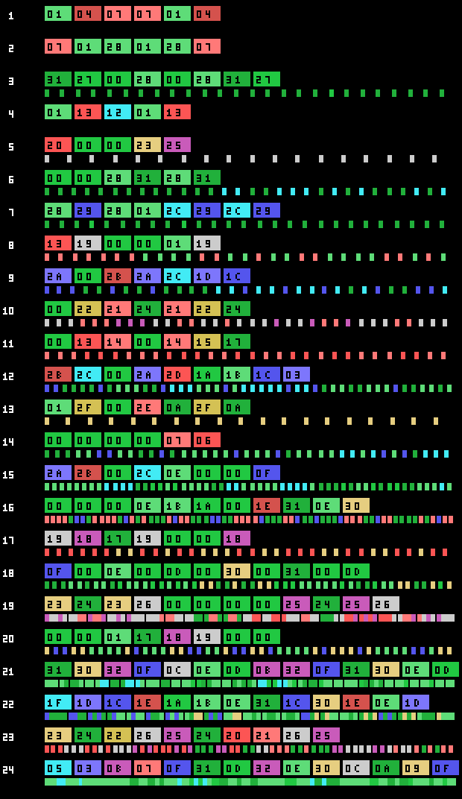
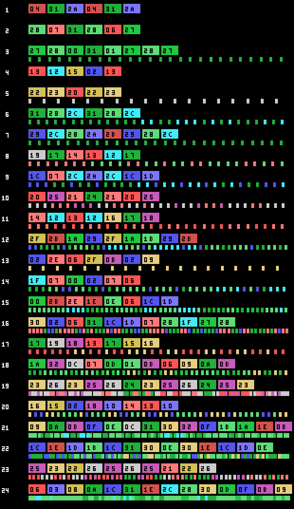

# El juego

*Penguin Adventure* (夢大陸アドベンチャー, *Yume Tairiku Adventure*) es la
continuación de *Antarctic Adventure*, y de un cartucho de 32 KB pasa a 128. El
pingüino corre hacia el fondo de la pantalla, esquiva lo que le sale al paso y
tiene que llegar a la meta antes de que se le acabe el tiempo.

Hay **dos pantallas de título** y el cartucho elige con el byte de país de la
BIOS (0x002B). La diferencia es un guion de más, el 0xA463, y sólo toca el
rótulo: el dibujo de fondo es el mismo.

## Veinticuatro fases, no trece

El cartucho le *declara* trece al Konami Game Master en su segunda cabecera, la
de 0x4010. El juego dice otra cosa: p02:8328 compara la fase con 0x19 y las
tres tablas de guion —terreno, enemigos y la tercera— cierran en veinticuatro
entradas justas.

Cada fila es una fase. Los bloques de color son los tramos de terreno en el
orden en que salen, y las marcas de debajo, los bichos que el guion suelta. Las
tres primeras fases no sueltan ninguno: su guion es un `0xFF` pelado.

El menú del título deja elegir entre **LEVEL 1** y **LEVEL 2**, y esa elección
no cambia lo difícil que es un tramo: cambia **los veinticuatro recorridos
enteros**. Son dos tablas de terreno distintas del banco 10 —0x8000 y 0x80F9— y
p01:675B escoge con 0xE08F, que es la copia que p02:813B hace de 0xE082 al
empezar la partida. Ni un solo tramo coincide byte a byte entre las dos.

## Diez decorados

El terreno se monta con diez decorados, cada uno con sus caracteres —tres
cargas, una por tercio de pantalla— y 672 bytes de tabla de nombres que
p01:6000 descomprime en 0xEBE0.

Los decorados 8 y 9 no los usa ninguna de las veinticuatro fases: los ponen a
mano p03:B602 y p03:B932 para dos escenas de por medio.

## El tiempo, que corre solo

0xE08B es el tiempo, y baja uno **cada 32 cuadros se ande o no se ande**
(p02:922D). Por debajo de 0x15 pita un cuadro sí y otro no, y al acabar la fase
p02:94D1 lo cambia por puntos de 0x20 en 0x20.

Lo que va bajando con el terreno es otra cosa, 0xE08D, y de ella salen los nueve
cortes del final de fase: a 0x30, 0x25, 0x20, 0x15, 0x10, 8, 5, 2 y 0 de la meta
pasa algo distinto (p01:65CF).

## La tienda y la máquina de apostar

Entre fase y fase hay dos sitios donde gastar los puntos.

La **tienda** tiene seis casillas de dos bytes —qué es y cuánto cuesta—, un
cursor que se mueve con izquierda y derecha con el efecto 0x23, y el marcador
haciendo de dinero. Comprar resta en BCD; si no llega, suena el 0x25 y no pasa
nada.

Y la **máquina de apostar**:

Se apuesta moviendo dinero entre el marcador y una bolsa —arriba y abajo de uno
en uno, izquierda y derecha de diez en diez—, los tres rodillos giran y lo
apostado se multiplica por lo que salga. La tabla de premios está pintada en la
propia máquina, y dice lo mismo que el código.

La cereza ocupa **cinco** de las dieciséis casillas de la tabla de 0x7B34, así
que sale el 31,2 % de las veces por rodillo. Y es el único símbolo que cuenta
suelto: una paga ×1, dos ×2 y tres ×4. Los demás sólo pagan de tres en tres —×8,
×10, ×15, ×20 y el premio gordo—. Al menos una cereza sale en el **67,5 %** de
las tiradas.

## Lo que se lleva encima

Cinco ranuras en 0xE440, y lo que llevan decide si un golpe mata o no:

| lo que se lleva | de qué salva |
|---|---|
| 0xE1F1 | de todo: para cualquier golpe y cualquier hueco |
| 0xE164 | de los bichos de clase 6 y 12; se gasta uno por golpe |
| 0xE165 | de las clases 1 y 13; se gasta uno por golpe |
| 0xE170 | de las clases 5 y 14; esta no se gasta |
| 0xE163 | de la clase 6 de los otros huecos |
| 0xE16B | de la clase 4, que no mata: sólo para el juego 0x80 cuadros |

Y los huecos del suelo —los objetos de clase 14— cuestan la vida salvo que se
lleve 0xE1F1, 0xE171 o 0xE172. Con 0xE1F1 puesto no sólo no se cae: el hueco
cambia de variante y caen 768 puntos.
